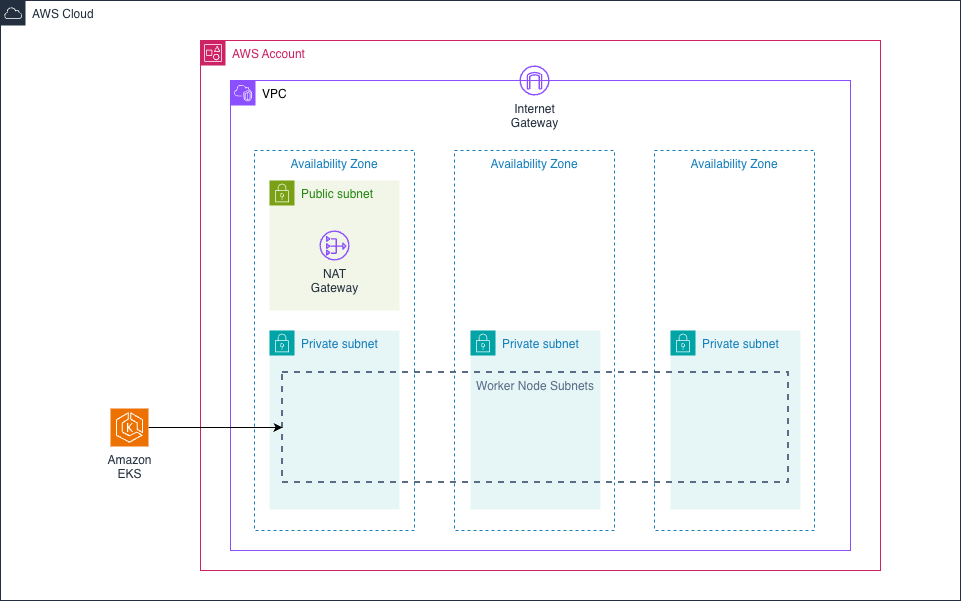

# Getting Started

## Overview
This repository provides a simple introduction to Amazon EKS. The intention is to add code samples and demos to help explain the core features.


## AWS Architecture
The initial Terraform script sets up the following architecture in AWS:



There are 3 input variables that must be set in the `terraform.tfvars` configuration file:

* `aws_region` - the AWS region code to deploy the infrastructure into e.g. eu-west-2
* `cluster_name` - the name for the Amazon EKS cluster
* `vpc_cidr` - the CIDR range to use for the VPC to be created

The script creates a VPC with three public subnets and three private subnets. There is only one NAT Gateway configured to keep the cost down for a sandbox / development environment. We need at least two public subnets because the ALB Load Balancer Controller installed with EKS Auto Mode requires at least 2 public subnets to create an internet-facing ALB which we utilise in this guide.

An Amazon EKS cluster using Auto Mode is created with the private subnets provided as the location for any worker nodes.


## Prerequisites
- AWS CLI configured with credentials
- Terraform installed
- kubectl installed

## Deploy Infrastructure
The infrastructure can be deployed from the root of the git repository using the following commands.

```bash
cd terraform
cp terraform.tfvars.example terraform.tfvars
# Edit terraform.tfvars with your values
terraform init
terraform plan -out=tfplan
terraform apply tfplan
```


## Configure kubectl

```bash
# Use the output from terraform apply, or replace with your values
aws eks update-kubeconfig --name <cluster-name> --region <aws-region>
```

## Clean Up

```bash
terraform plan -destroy -out=destroy-plan
terraform apply destroy-plan
```
