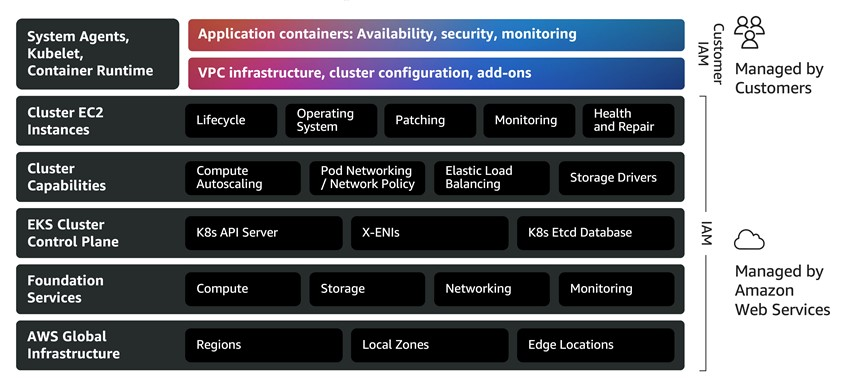

# Amazon EKS Auto Mode Overview

## Shared Responsibility Model
With Amazon EKS Auto Mode, AWS take on far more of the heavy undifferentiated lifting, including all cluster capabilities for compute, storage and networking. It also includes manging the operating system, patching and more as shown in the updated shared responsibility model for Auto Mode.



## Update kubectl
Once the cluster is up and running, we can update our local Kubernetes client so that it can talk to the EKS cluster.

```shell
aws eks update-kubeconfig --name <cluster-name> --region <region>
```

This merges configuration in a local `~/.kube/config` file.

## Testing the cluster

With the cluster started we can run the following command to see what pods are running in the cluster across all namespaces.

```shell
kubectl get pods -A
```

This returns `No resources found` in the Auto Mode cluster. We follow that up by looking at the custom resource definitions in the cluster.

```shell
terraform % kubectl get crds
NAME                                            CREATED AT
applicationnetworkpolicies.networking.k8s.aws   2025-12-15T13:12:45Z
clusternetworkpolicies.networking.k8s.aws       2025-12-15T13:12:45Z
clusterpolicyendpoints.networking.k8s.aws       2025-12-15T13:12:45Z
cninodes.eks.amazonaws.com                      2025-12-15T13:16:12Z
cninodes.vpcresources.k8s.aws                   2025-12-15T13:12:45Z
ingressclassparams.eks.amazonaws.com            2025-12-15T13:16:12Z
nodeclaims.karpenter.sh                         2025-12-15T13:16:17Z
nodeclasses.eks.amazonaws.com                   2025-12-15T13:16:17Z
nodediagnostics.eks.amazonaws.com               2025-12-15T13:16:18Z
nodepools.karpenter.sh                          2025-12-15T13:16:17Z
policyendpoints.networking.k8s.aws              2025-12-15T13:12:44Z
securitygrouppolicies.vpcresources.k8s.aws      2025-12-15T13:12:45Z
targetgroupbindings.eks.amazonaws.com           2025-12-15T13:16:12Z
```

Here we can see that AWS install a set of AWS-owned CRDs into an Auto Mode cluster that replace components that had to previously be manually managed such as CNI config and node groups.

We can see things in here for `nodeclaims` and `nodepools` which is the underlying open-source Karpenter project that provides the node auto-scaling. We can see `targetgroupbindings` and `ingressclassparams` that come from the AWS Load Balancer Controller. The Auto Mode cluster has these CRDs managed in the control plane to enable it to be ready to serve real workloads. They are running in the control plane and not the data plane, which is why we don't see any nodes or pods.

We can retrieve detailed configuration information about the cluster from the AWS control plane using the `aws describe-cluster` command. 

```shell
aws eks describe-cluster \
--name eks-test-cluster \
--query 'cluster.{AutoMode: computeConfig, Storage: storageConfig, Network: kubernetesNetworkConfig}' 
```

This should return the following:

```yaml
{
    "AutoMode": {
        "enabled": true,
        "nodePools": [
            "general-purpose"
        ],
        "nodeRoleArn": "arn:aws:iam::424727766526:role/eks-test-cluster-eks-auto-20251217104240154500000001"
    },
    "Storage": {
        "blockStorage": {
            "enabled": true
        }
    },
    "Network": {
        "serviceIpv4Cidr": "172.20.0.0/16",
        "ipFamily": "ipv4",
        "elasticLoadBalancing": {
            "enabled": true
        }
    }
}
```

This tells us that the cluster has Auto Mode enabled and is using the default `general-purpose` node pool. From a Storage perspective, it tells us that the cluster can provision EBS volumes, without any need to manually install and manage the EBS CSI driver. From a Network perspective, it tells us the internal CIDR range for the cluster (which is separate from the VPC CIDR range), and it shows that load balancing is enabled.

## Update Storage Class


```shell
kubectl get storageclass

NAME   PROVISIONER             RECLAIMPOLICY   VOLUMEBINDINGMODE      ALLOWVOLUMEEXPANSION   AGE
gp2    kubernetes.io/aws-ebs   Delete          WaitForFirstConsumer   false                  126m
```


kubectl apply -f ingressclass.yaml
ingressclass.networking.k8s.io/alb created

kubectl create namespace game-2048 --save-config
namespace/game-2048 created


kubectl apply -n game-2048 -f 2048_full.yaml

namespace/game-2048 configured
deployment.apps/deployment-2048 created
service/service-2048 created
ingress.networking.k8s.io/ingress-2048 created


kubectl get pods -A
NAMESPACE   NAME                               READY   STATUS    RESTARTS   AGE
game-2048   deployment-2048-7bf64bccb7-2n5sc   1/1     Running   0          55s
game-2048   deployment-2048-7bf64bccb7-9kh2c   1/1     Running   0          55s
game-2048   deployment-2048-7bf64bccb7-gp79q   1/1     Running   0          55s
game-2048   deployment-2048-7bf64bccb7-jg98j   1/1     Running   0          55s
game-2048   deployment-2048-7bf64bccb7-jvtq8   1/1     Running   0          55s

kubectl get nodes -A
NAME                  STATUS   ROLES    AGE   VERSION
i-023a6d1f4815fcdb0   Ready    <none>   52s   v1.34.1-eks-113cf36


kubectl get ingress -n game-2048
NAME           CLASS   HOSTS   ADDRESS                                                                   PORTS   AGE
ingress-2048   alb     *       k8s-game2048-ingress2-d14358e9b2-1354178268.eu-west-2.elb.amazonaws.com   80      78s


kubectl delete -n game-2048 -f 2048_full.yaml
Warning: deleting cluster-scoped resources, not scoped to the provided namespace
namespace "game-2048" deleted
deployment.apps "deployment-2048" deleted
service "service-2048" deleted
ingress.networking.k8s.io "ingress-2048" deleted


```shell
amazon-eks-guide % kubectl get services -A
NAMESPACE     NAME                        TYPE        CLUSTER-IP      EXTERNAL-IP   PORT(S)   AGE
default       kubernetes                  ClusterIP   172.20.0.1      <none>        443/TCP   40m
kube-system   eks-extension-metrics-api   ClusterIP   172.20.126.86   <none>        443/TCP   40m
mattlewis@Matts-MacBook-Pro-2 amazon-eks-guide % kubectl get all -n kube-system
NAME                                TYPE        CLUSTER-IP      EXTERNAL-IP   PORT(S)   AGE
service/eks-extension-metrics-api   ClusterIP   172.20.126.86   <none>        443/TCP   40m
```


```shell
amazon-eks-guide % kubectl get crd | grep -E "(eks|karpenter|auto)"
cninodes.eks.amazonaws.com                      2025-12-12T21:39:08Z
ingressclassparams.eks.amazonaws.com            2025-12-12T21:39:08Z
nodeclaims.karpenter.sh                         2025-12-12T21:39:09Z
nodeclasses.eks.amazonaws.com                   2025-12-12T21:39:09Z
nodediagnostics.eks.amazonaws.com               2025-12-12T21:39:09Z
nodepools.karpenter.sh                          2025-12-12T21:39:09Z
targetgroupbindings.eks.amazonaws.com           2025-12-12T21:39:08Z
```

```shell
amazon-eks-guide % aws eks describe-cluster --name eks-test-cluster --region eu-west-2 --profile san
dbox --query 'cluster.{AutoMode: computeConfig, Storage: storageConfig, Network: kubernetesNetworkConfig}'
{
    "AutoMode": {
        "enabled": true,
        "nodePools": [
            "general-purpose",
            "system"
        ],
        "nodeRoleArn": "arn:aws:iam::424727766526:role/eks-test-cluster-eks-auto-20251212212851103100000001"
    },
    "Storage": {
        "blockStorage": {
            "enabled": true
        }
    },
    "Network": {
        "serviceIpv4Cidr": "172.20.0.0/16",
        "ipFamily": "ipv4",
        "elasticLoadBalancing": {
            "enabled": true
        }
    }
}
```

aws eks describe-cluster \
  --name eks-test-cluster \
  --query "{networking:cluster.kubernetesNetworkConfig.elasticLoadBalancing, storage:cluster.storageConfig.blockStorage}"

{
    "networking": {
        "enabled": true
    },
    "storage": {
        "enabled": true
    }
}


EKS Auto Mode Test Results: SUCCESS!
✅ What We Confirmed:
Auto Mode Enabled: computeConfig.enabled: true
NodePool Ready: general-purpose nodepool exists and is ready
Automatic Node Provisioning: Node i-0aac5ee7a39c88fc9 was created automatically
Correct Labels: Node has eks.amazonaws.com/compute-type=auto and karpenter.sh/nodepool=general-purpose
Pod Scheduling: Pods successfully scheduled and running
Instance Selection: Auto Mode chose c6a.large instance automatically
Bottlerocket OS: Using optimized Bottlerocket AMI for EKS Auto Mode
🔍 Key Auto Mode Features Verified:
Automatic scaling: Node appeared when workload was deployed
Intelligent instance selection: Chose appropriate c6a.large for nginx workload
Managed infrastructure: Using Bottlerocket OS with containerd 2.1
Karpenter integration: Node managed by Karpenter (karpenter.sh/* labels)
Cost optimization: Single node handles both pods efficiently

Deploy a simple workload to trigger node creation

```shell
kubectl create deployment nginx-test --image=nginx --replicas=2

deployment.apps/nginx-test created
```


kubectl get pods -o wide


amazon-eks-guide % kubectl get pods -o wide
NAME                          READY   STATUS              RESTARTS   AGE   IP       NODE                  NOMINATED NODE   READINESS GATES
nginx-test-586bbf5c4c-5qnld   0/1     ContainerCreating   0          23s   <none>   i-0aac5ee7a39c88fc9   <none>           <none>
nginx-test-586bbf5c4c-s2qxl   0/1     ContainerCreating   0          23s   <none>   i-0aac5ee7a39c88fc9   <none>           <none>
mattlewis@Matts-MacBook-Pro-2 amazon-eks-guide % 

amazon-eks-guide % kubectl get nodes -o wide
NAME                  STATUS   ROLES    AGE   VERSION               INTERNAL-IP   EXTERNAL-IP   OS-IMAGE                                                              KERNEL-VERSION   CONTAINER-RUNTIME
i-0aac5ee7a39c88fc9   Ready    <none>   21s   v1.34.1-eks-113cf36   10.0.5.30     <none>        Bottlerocket (EKS Auto, Standard) 2025.12.5 (aws-k8s-1.34-standard)   6.12.55          containerd://2.1.5+bottlerocket
mattlewis@Matts-MacBook-Pro-2 amazon-eks-guide % 


amazon-eks-guide % kubectl get nodes --show-labels
NAME                  STATUS   ROLES    AGE   VERSION               LABELS
i-0aac5ee7a39c88fc9   Ready    <none>   37s   v1.34.1-eks-113cf36   app.kubernetes.io/managed-by=eks,beta.kubernetes.io/arch=amd64,beta.kubernetes.io/instance-type=c6a.large,beta.kubernetes.io/os=linux,eks.amazonaws.com/compute-type=auto,eks.amazonaws.com/instance-capability-flex=false,eks.amazonaws.com/instance-category=c,eks.amazonaws.com/instance-cpu-manufacturer=amd,eks.amazonaws.com/instance-cpu-sustained-clock-speed-mhz=3600,eks.amazonaws.com/instance-cpu=2,eks.amazonaws.com/instance-ebs-bandwidth=10000,eks.amazonaws.com/instance-encryption-in-transit-supported=true,eks.amazonaws.com/instance-family=c6a,eks.amazonaws.com/instance-generation=6,eks.amazonaws.com/instance-hypervisor=nitro,eks.amazonaws.com/instance-memory=4096,eks.amazonaws.com/instance-network-bandwidth=781,eks.amazonaws.com/instance-size=large,eks.amazonaws.com/nodeclass=default,failure-domain.beta.kubernetes.io/region=eu-west-2,failure-domain.beta.kubernetes.io/zone=eu-west-2c,k8s.io/cloud-provider-aws=e1b03224209c15b2d84b2e89ca2758fd,karpenter.sh/capacity-type=on-demand,karpenter.sh/do-not-sync-taints=true,karpenter.sh/initialized=true,karpenter.sh/nodepool=general-purpose,karpenter.sh/registered=true,kubernetes.io/arch=amd64,kubernetes.io/hostname=i-0aac5ee7a39c88fc9,kubernetes.io/os=linux,node.kubernetes.io/instance-type=c6a.large,topology.ebs.csi.eks.amazonaws.com/zone=eu-west-2c,topology.k8s.aws/zone-id=euw2-az1,topology.kubernetes.io/region=eu-west-2,topology.kubernetes.io/zone=eu-west-2c
mattlewis@Matts-MacBook-Pro-2 amazon-eks-guide % 


amazon-eks-guide % kubectl get pods
NAME                          READY   STATUS    RESTARTS   AGE
nginx-test-586bbf5c4c-5qnld   1/1     Running   0          74s
nginx-test-586bbf5c4c-s2qxl   1/1     Running   0          74s
mattlewis@Matts-MacBook-Pro-2 amazon-eks-guide % 


amazon-eks-guide % kubectl delete deployment nginx-test
deployment.apps "nginx-test" deleted
mattlewis@Matts-MacBook-Pro-2 amazon-eks-guide % 


Amazon EKS Auto mode includes capabilities that deliver essential cluster functionality, including:

* Pod networking
* Service networking
* Cluster DNS
* Autoscaling
* Block storage
* Load balancer controller
* Pod Identity agent
* Node monitoring agent

With Auto mode compute, many commonly used EKS add-ons become redundant, such as:

* Amazon VPC CNI
* kube-proxy
* CoreDNS
* Amazon EBS CSI Driver
* EKS Pod Identity Agent


kubectl get nodepool general-purpose -o yaml

```yaml
apiVersion: karpenter.sh/v1
kind: NodePool
metadata:
  annotations:
    karpenter.sh/nodepool-hash: "4012513481623584108"
    karpenter.sh/nodepool-hash-version: v3
  creationTimestamp: "2025-12-13T17:26:55Z"
  generation: 1
  labels:
    app.kubernetes.io/managed-by: eks
  name: general-purpose
  resourceVersion: "16335"
  uid: a5714d26-9f7d-4e14-81fd-d9b76f1796c5
spec:
  disruption:
    budgets:
    - nodes: 10%
    consolidateAfter: 30s
    consolidationPolicy: WhenEmptyOrUnderutilized
  template:
    metadata: {}
    spec:
      expireAfter: 336h
      nodeClassRef:
        group: eks.amazonaws.com
        kind: NodeClass
        name: default
      requirements:
      - key: karpenter.sh/capacity-type
        operator: In
        values:
        - on-demand
      - key: eks.amazonaws.com/instance-category
        operator: In
        values:
        - c
        - m
        - r
      - key: eks.amazonaws.com/instance-generation
        operator: Gt
        values:
        - "4"
      - key: kubernetes.io/arch
        operator: In
        values:
        - amd64
      - key: kubernetes.io/os
        operator: In
        values:
        - linux
      terminationGracePeriod: 24h0m0s
status:
  conditions:
  - lastTransitionTime: "2025-12-13T17:27:43Z"
    message: ""
    observedGeneration: 1
    reason: ValidationSucceeded
    status: "True"
    type: ValidationSucceeded
  - lastTransitionTime: "2025-12-13T17:28:05Z"
    message: ""
    observedGeneration: 1
    reason: NodeClassReady
    status: "True"
    type: NodeClassReady
  - lastTransitionTime: "2025-12-13T18:03:39Z"
    message: ""
    observedGeneration: 1
    reason: NodeRegistrationHealthy
    status: "True"
    type: NodeRegistrationHealthy
  - lastTransitionTime: "2025-12-13T17:28:05Z"
    message: ""
    observedGeneration: 1
    reason: Ready
    status: "True"
    type: Ready
  nodeClassObservedGeneration: 1
  nodes: 0
  resources:
    cpu: "0"
    ephemeral-storage: "0"
    memory: "0"
    nodes: "0"
    pods: "0"
```

