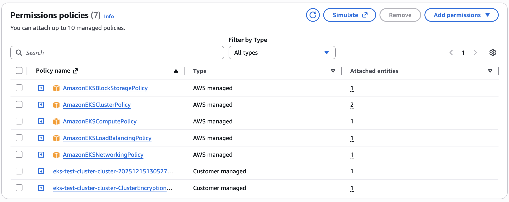
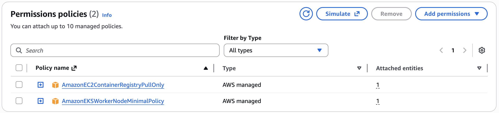

# Amazon EKS Setup

This section runs through the terraform configuration for deploying the Amazon EKS cluster using Auto Mode.

The choice was made to use the community Terraform modules to create the VPC and EKS cluster, as this requires less code and uses built-in best practices. In this section we will run through exactly what gets created.

## Terraform Modules
The following community Terraform modules are used:

* **VPC Module `terraform-aws-modules/vpc/aws` (v6.5.1)** - this creates the VPC, subnets, NAT Gateway, Elastic IP, Internet Gateway and route tables
* **EKS Module `terraform-aws-modules/eks/aws` (v21.10.1)** - this creates the EKS cluster, roles and Auto Mode configuration

## Amazon EKS creation
The Amazon EKS cluster is created using the EKS module.

The first part of the configuration is the module declaration. This declares a terraform module called `eks` that uses a specific version of the official community EKS module from the Terraform Registry.

```terraform
# EKS Module with Auto Mode (official syntax)
module "eks" {
  source  = "terraform-aws-modules/eks/aws"
  version = "21.10.1"
  ...
}
```

The next section specifies the name for the EKS cluster, and the specifies the exact version of Kubernetes that needs to run.

```terraform
  name               = var.cluster_name
  kubernetes_version = "1.34"
```

The next section declares that the Kubernetes API endpoint is reachable over the public internet and has a public DNS name. This still requires valid AWS credentials and Kubernetes RCAC permissions. This is deemed acceptable for a demonstration environment, although it is common for this to be disabled in certain production environments. 

```terraform
  # Optional: Public access to API server
  endpoint_public_access = true
```

The next section configures `EKS Access Entries` so that the AWS IAM identity which executes the `terraform apply` command is granted `cluster admin` permissions. The means the user can carry out `kubectl` commands without having to manually make changes to the `aws-auth` ConfigMap.

```terraform
  # Optional: Adds the current caller identity as an administrator via cluster access entry
  enable_cluster_creator_admin_permissions = true
```

The next section is the one that enables Auto Mode for the EKS cluster. This tells the module to use EKS Auto Mode instead of having to create managed node groups. EKS Auto Mode has two built-in node pools - `system` and `general-purpose`. The `system` node pool has a taint for `CriticalAddonsOnly` and so is reserved for EKS add-ons that have this taint such as CoreDNS, and not for customer workloads. The `general-purpose` node pool is the default for supporting general purpose customer workloads. If you do not enable the `general-purpose` node pool, then you will need to configure a custom NodeClass and configure a NodePool to use it. More details around exactly what is created with EKS Auto Mode is defined in the next section.

```terraform
  # EKS Auto Mode configuration
  compute_config = {
    enabled    = true
    node_pools = ["general-purpose", "system"]
  }
```

The next section passes the VPC id from the `vpc` module. The private subnet IDs are specified as the only subnets where the cluster data plane will logically run. In the context of an Amazon EKS Auto Mode cluster, this means that the control plane will attach ENIs into these subnets when needed.

```terraform
  # Connect to VPC module outputs
  vpc_id     = module.vpc.vpc_id
  subnet_ids = module.vpc.private_subnets
```

The final section shows an example of setting tags on all resources created by the module, such as the cluster itself, security groups and associated IAM roles.

```terraform
  tags = {
    Environment = "test"
    Terraform   = "true"
  }
```

## Amazon EKS Auto Mode Setup

The section in terraform that sets up the Amazon EKS Auto Mode cluster is shown below:

```terraform
  # EKS Auto Mode configuration
  compute_config = {
    enabled    = true
    node_pools = ["general-purpose", "system"]
  }
```


### Cluster IAM Role
The Cluster IAM role is an AWS Identity and Access Management (IAM) role used by Amazon EKS to manage permissions for Kubernetes clusters. Kubernetes clusters managed by Amazon EKS use this role to automate routine tasks for storage, networking, and compute autoscaling. The policies attached to the role are shown below:




* **AmazonEKSBlockStoragePolicy** - This policy grants the necessary permissions for Amazon EKS to create, manage, and maintain EC2 volumes and snapshots for the EKS cluster, enabling the control plane and worker nodes to provision and use persistent storage as required by Kubernetes workloads.
* **AmazonEKSClusterPolicy** - This policy allows Amazon EKS to make calls to other required AWS services that are needed by Auto Mode
* **AmazonEKSComputePolicy** - This policy grants the permissions required for Amazon EKS to create and manage EC2 instances for the EKS cluster, and the necessary IAM permissions to configure EC2. Also, this policy grants the permissions for Amazon EKS to create the EC2 Spot service-linked role on your behalf.
* **AmazonEKSLoadBalancingPolicy** - This IAM policy grants the necessary permissions for Amazon EKS to work with various AWS services to manage Elastic Load Balancers (ELBs) and related resources.
* **AmazonEKSNetworkingPolicy** - This policy is designed to grant the necessary permissions for Amazon EKS to create and manage network interfaces for the EKS cluster, allowing the control plane and worker nodes to communicate and function properly.
* **Custom Tag Policy** -  By default, the managed policies related to EKS Auto Mode do not permit applying user defined tags to Auto Mode provisioned AWS resources. If you want to apply user defined tags to AWS resources, you must attach additional permissions to the Cluster IAM Role with sufficient permissions to create and modify tags on AWS resources. See [link](https://docs.aws.amazon.com/eks/latest/userguide/auto-learn-iam.html#tag-prop)
* **Cluster Encryption Policy** - As of v19 of the community EKS module, clusters created by the module default to secret encryption by default with a customer-managed KMS key created by the module. This policy allows the IAM role to use this custom CMK key. This behavior will be evaluated at the next breaking change given that secrets are now automatically encrypted at rest by default from Kubernetes 1.28+ with Amazon EKS.

**Trust Relationship**
The Cluster IAM Role has a trust relationship associated with it that allows Amazon EKS to assume the role and to attach session tags when it assumes the role.

```yaml
{
    "Version": "2012-10-17",
    "Statement": [
        {
            "Sid": "EKSClusterAssumeRole",
            "Effect": "Allow",
            "Principal": {
                "Service": "eks.amazonaws.com"
            },
            "Action": [
                "sts:TagSession",
                "sts:AssumeRole"
            ]
        }
    ]
}
```

### Node IAM Role
The Node IAM role is an AWS Identity and Access Management (IAM) role used by Amazon EKS to manage permissions for worker nodes in Kubernetes clusters. This role grants EC2 instances running as Kubernetes nodes the necessary permissions to interact with AWS services and resources, and is automatically configured with Kubernetes RBAC permissions using EKS access entries.




* **AmazonEC2ContainerRegistryPullOnly** - This policy provides permissions for the `kubelet` to pull images from Amazon EC2 Container Registry repositories. The permissions to use container images from Amazon ECR are required because the built-in add-ons for networking run pods that use container images from Amazon ECR
* **AmazonEKSWorkerNodeMinimalPolicy** - This policy allows Amazon EKS worker nodes to connect to Amazon EKS Clusters. The policy itself grants permission to the `eks-auth:AssumeRoleForPodIdentity` action. EKS Pod Identity is the recommended method over IRSA (IAM Roles for Service Accounts)for providing IAM credentials to pods running in EKS clusters. This allows the EKS Pod Identity Agent (running on the cluster nodes) to assume IAM roles on behalf of pods that have been configured with pod identity associations.

**Trust Relationship**
The Node IAM Role has a trust relationship associated with it that allows Amazon EKS to assume the role and to attach session tags when it assumes the role.

```yaml
{
    "Version": "2012-10-17",
    "Statement": [
        {
            "Sid": "EKSAutoNodeAssumeRole",
            "Effect": "Allow",
            "Principal": {
                "Service": "ec2.amazonaws.com"
            },
            "Action": [
                "sts:TagSession",
                "sts:AssumeRole"
            ]
        }
    ]
}
```

## Security Groups
Amazon VPC Security groups control communications within the Amazon EKS cluster including between the managed Kubernetes control plane and compute resources in your AWS account such as worker nodes and Fargate pods.

The `Cluster Security Group` is a unified security group that is used to control communications between the Kubernetes control plane and compute resources on the cluster. The cluster security group is applied by default to the Kubernetes control plane managed by Amazon EKS as well as any managed compute resources created by Amazon EKS. Additional cluster security groups control communications from the Kubernetes control plane to compute resources in your account. Worker node security groups are security groups applied to unmanaged worker nodes that control communications from worker nodes to the Kubernetes control plane.

## Next Steps
Now we have launched an Amazon EKS Auto Mode cluster, it's time to test it to understand it some more

[](./auto-mode-overview.md)

